.. _get-started-section:

=============================
Getting Started with Usergrid
=============================

To appreciate the extensive functionality of Usergrid, this section steps you through *Messagee*, a simple Twitter-style messaging application. There are two client versions of Messagee available: 

* An :ref:`messagee-ios`  
* An :ref:`messagee-android`  

The descriptions below shows you how easy it is to create a new app, populate a series of test users, and test the app. To run a copy of *Messagee*, you’ll use the Usergrid Admin Portal, a user interface that streamlines Usergrid data and application management. The portal itself is also a reference application that shows how to incorporate Usergrid APIs with Javascript (for a more detailed discussion of the portal’s functionality, see :ref:`portal-section`).

.. _messagee-setup:

--------------------------
Creating an App and Users 
--------------------------

**1.** Enter the URL https://apigee.com/usergrid/ in your browser to access the login screen for the *Usergrid Admin Portal*. If you are new to Usergrid, sign up for an account to access the portal, specifying an organization (e.g., the name of your company or project team) and a username and password that you’ll use to authenticate. Since Usergrid is designed for use by development teams, the same username can be associated with one or more organizations. 

New accounts receive a confirmation email that contains a URL that you must click to activate the account. After this, simply log into the portal with your username and password.

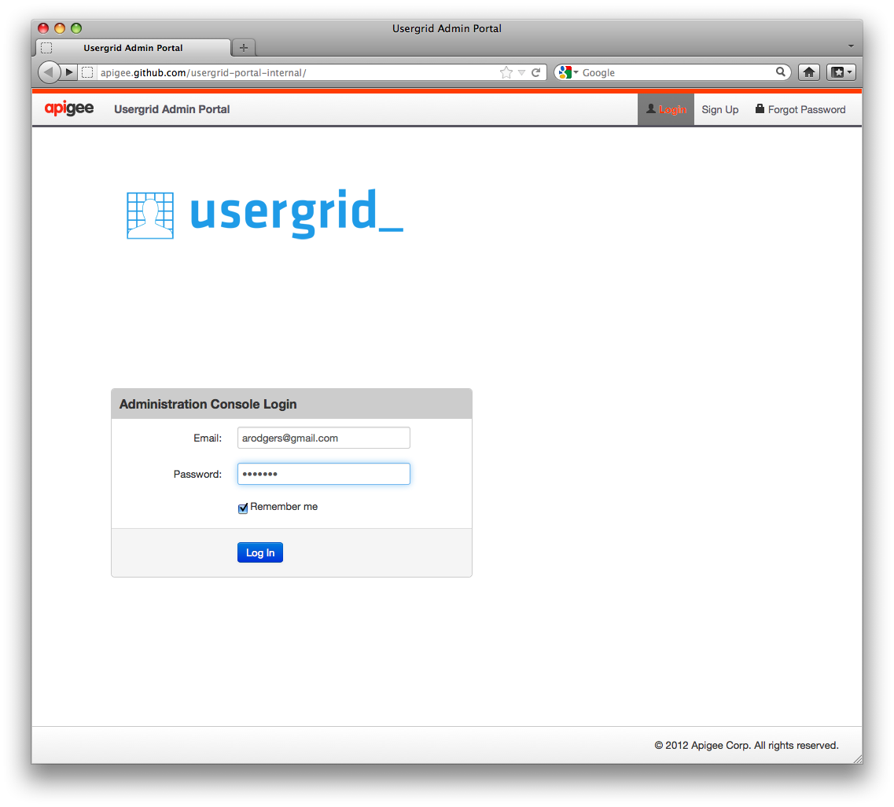

**2.** Click on **New Application** to begin creating a new application:

.. figure:: _static/portal-1.png

**3.** Enter a unique application name. The name must be unique to avoid a conflict with another user running the same application.

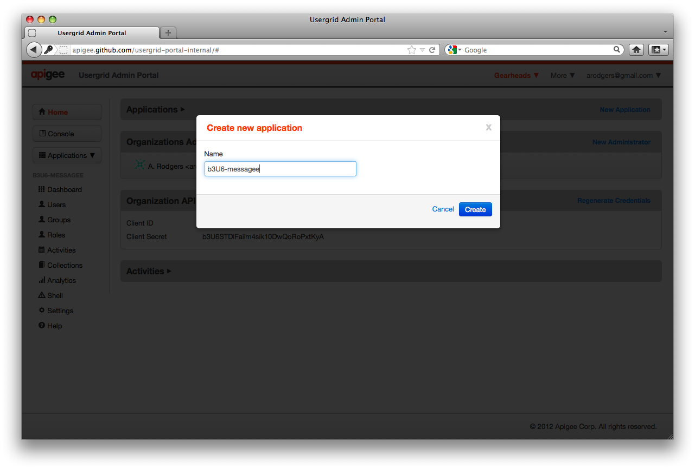

**4.** Make sure that the portal shows the application name you entered as the active application beneath the “Applications” drop down menu, shown as **(1)**. (If it's not, click on the drop down menu and select your application.) Next, we need to populate a test user *user-test-1* that is going to login to your copy of the server-side  *Messagee* app. Click on the *Users* box on the left side of the console, shown as **(2)**.

.. figure:: _static/portal-3.png

**5.** Click on the **Add** button and enter the user information for your application in the pop-up window (be sure to enter a password you’ll remember). Click on the **Create** button when you’re finished. Repeat these steps to create a second user named *test-user-2*.

.. figure:: _static/portal-4.png

**6.**  So far, you've created a uniquely named copy of the *Messagee* application as well as two user accounts (*test-user-1* and *test-user-2*) associated with the app. You’ll use *test-user-1* to log into your copy of *Messagee* and *test-user-2* as a user to follow. To continue with the example, follow the instructions for a client app (either the :ref:`messagee-ios` or the :ref:`messagee-android`).  

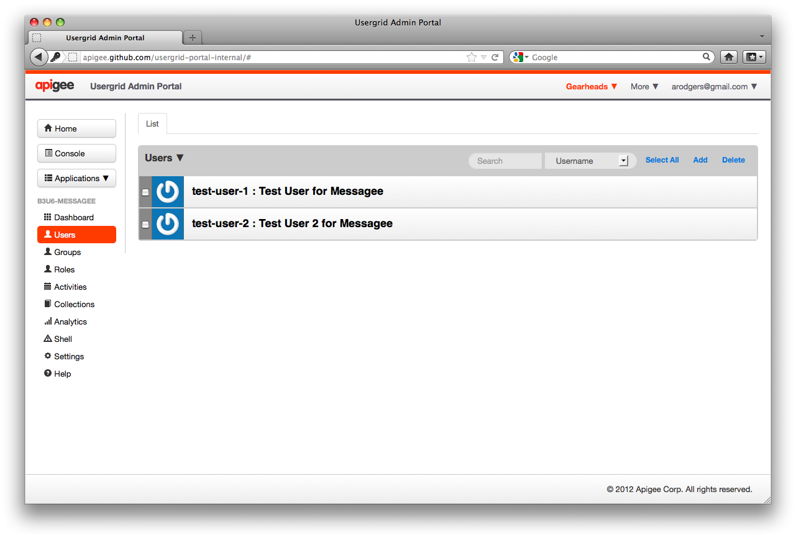

.. _messagee-ios:

-------------
iOS Client 
-------------

Messagee is available as an iPhone app that uses Usergrid and RestKit.
The source for the iOS version of Messagee is available on GitHub at: 

    https://github.com/usergrid/usergrid-sample-ios-messagee 

Here are the steps to run the *Messagee* app on iOS:

**1.** Run Steps 1-6 under :ref:`messagee-setup`. These steps create a unique instance of the *Messagee* app on the server and two test users, *test-user-1* and *test-user-2*.

**2.** Access the *Messagee* server app by typing a URL similar to the following into your iOS mobile client (replace <Messagee> with the unique name of your application): 

    http://api.usergrid.com/<Messagee>/index.html

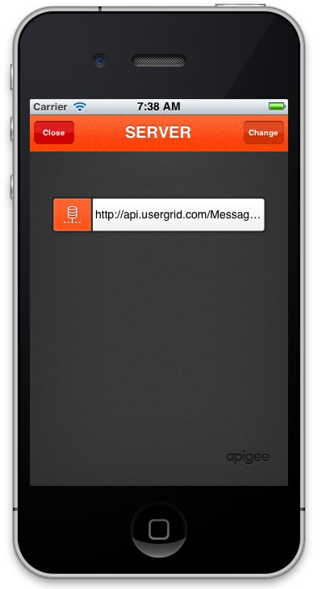

**3.** On the mobile client, complete the registration information and click **Register**.

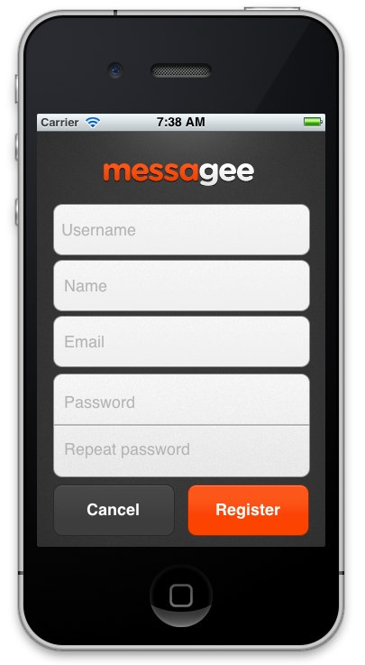

**4.** Log into the Messagee app by entering the *test-user-1* account information created previously. Click on the **Sign in** button.

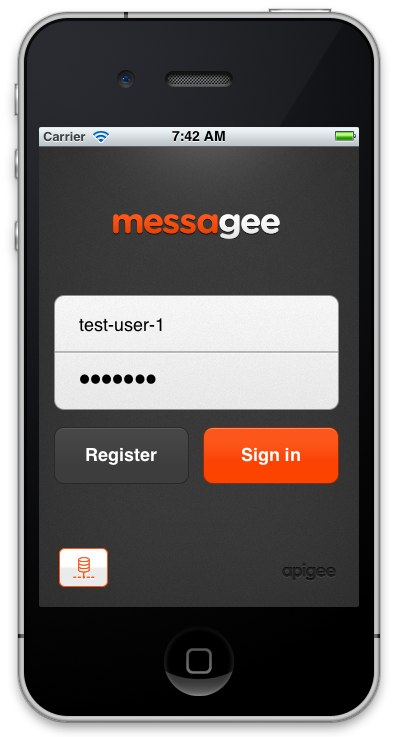

The Message Board at this point is empty:

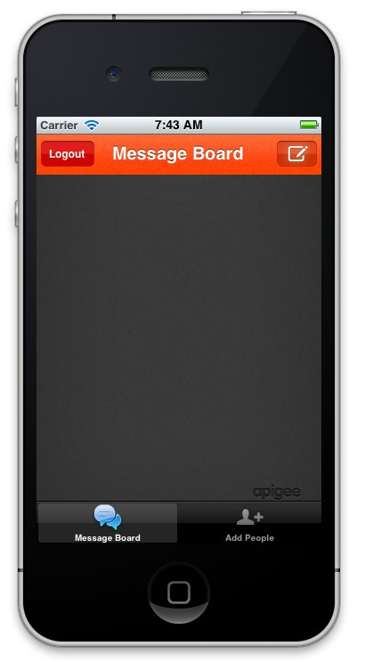

**4.** Post a message using the app. Click on the top-right icon in the Message Board to create a message, write the message text, and send it by clicking on **Post**.

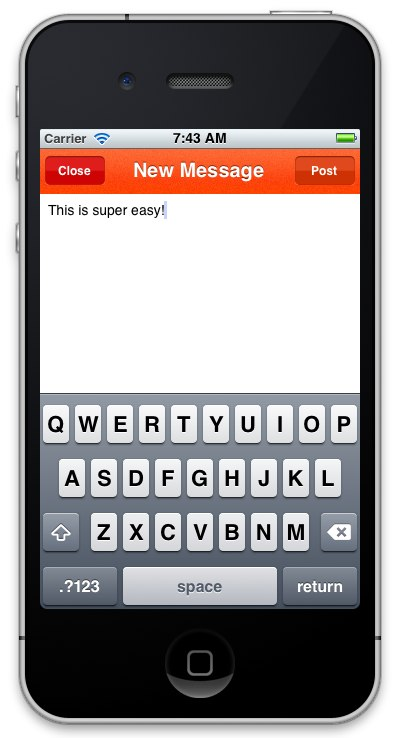

**Note:** The posted message should appear in the Message Board within few seconds.

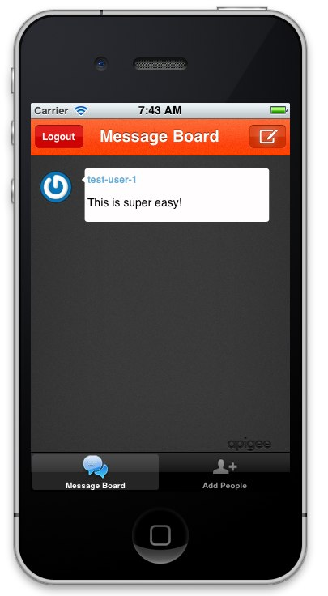

**5.** For your instance of the *Messagee* application to act like Twitter, you need to “follow” another user. In the Message Board, click on **Add People** and add *test-user-2* as a person that *test-user-1* will follow. 

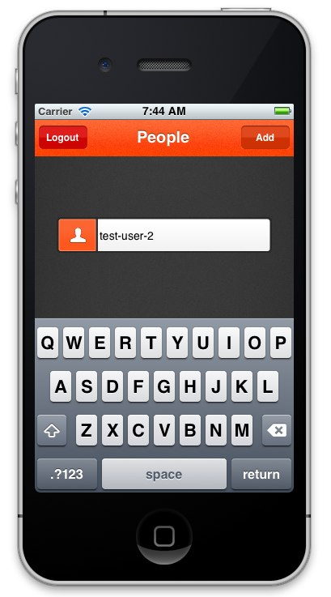

**7.** Log in as *test-user-2* and post a message as this user to the Message Board.

**8.** Go back and log in as user *test-user-1*. Since *test-user-1* follows *test-user-2*, you should see the message sent by *test-user-2* in the Message Board.

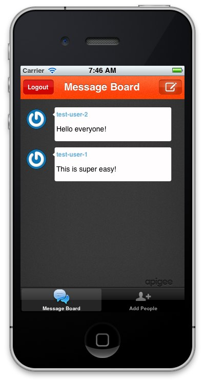

.. _messagee-android:

----------------
iOS SDK
----------------

If you want to write iOS applications that connect to Usergrid, you can download the Usergrid iOS SDK at:

https://github.com/usergrid/usergrid-android-sdk
Note: The Messagee iOS application uses RestKit, a popular REST framework for iOS, in order to communicate with the Usergrid service.  Because Usergrid uses a REST API, you can use any REST framework to talk with the service.  However, the official Usergrid iOS SDK provides a more convenient mechanism for doing this and you should use this unless you’re already using RestKit or some other framework in your project.

----------------
Android Client 
----------------

Messagee is also available as a sample Android app that acts as a Usergrid client. 
The source for the Android version is available on GitHub at: 

https://github.com/usergrid/usergrid-android-sample-messagee

----------------
Android SDK 
----------------

For writing Android applications, you can use the Usergrid Android SDK at:

https://github.com/usergrid/usergrid-android-sdk

 

[a]
[a]Ed Anuff:
This flow is not going to work.  App names are global to the system and naming it "Messagee" is going to conflict with someone else's app.   They'll also need to set their copy of the Messagee client app to talk to the correct Messagee backend instance they create.
________________
Ed Anuff:
_Marked as resolved_
________________
Ed Anuff:
_Re-opened_