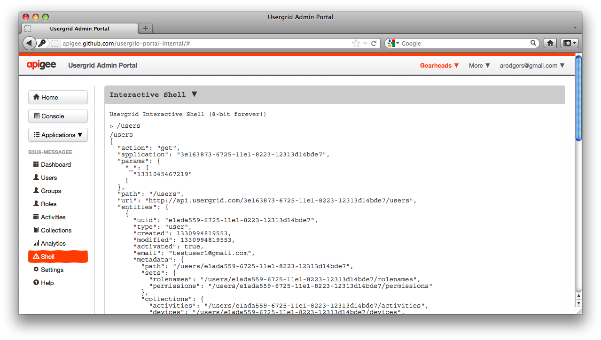
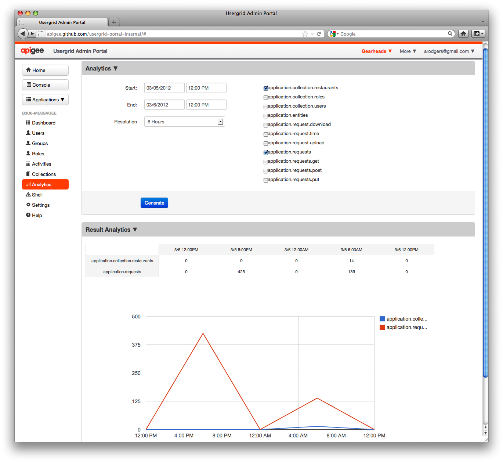

.. _portal-section:

======================
Usergrid Admin Portal
======================

The Usergrid Admin Portal is the primary administrative user interface for working
with Usergrid. The portal is also the most complete reference application that demonstrates how to incorporate Usergrid with Javascript. 

The Admin Portal available online at https://apigee.com/usergrid/.  The portal source code is fully open source and forkable, available for download on GitHub at https://github.com/usergrid/portal. You can easily extend the portal, embed it into your own applications, or inspect the code to learn best practices associated with the Usergrid API. The Usergrid Javascript client is also part of the GitHub portal project.

.. figure:: _static/portal-home.png

  :sub:`Usergrid Admin Portal.`

The portal opens in your default web browser, either Safari, Firefox, or Google Chrome. The :ref:`get-started-section` describes how to use the portal to run a sample application, while this section describes portal components in more detail and highlights Usergrid features.  

------------
Account Home
------------

When you log into the portal, you are presented with a **Home** page for managing applications and data for your Organization. The Home page displays: 

* Applications associated with the currently selected Organization 
* Administrators that are part of that Organization
* API credentials for the Organization
* Activities performed recently by administrators
* A menu for building, organizing, and managing application content

------------
Applications
------------

For every app that you build, you typically create a new application space within
Usergrid. This allows each app to have its own private infrastructure to store its
objects and data. In some cases, if you have multiple apps that share much of
the same data and users, you might represent them in Usergrid as a single
application, which would allow those apps to share the same data space.

Application Dashboard
---------------------

The **Dashboard** shows all available information for the selected application. You
can see the activity level, the total number of entities, entities created in the last
day, week, and month, and other vital statistics for monitoring application health as well as quota limits.

.. figure:: _static/dashboard.png

Administration for Multiple Organizations
-----------------------------------------

The portal is designed to let you work within the context of a single organization at any one point in time. Since it is possible to be an administrator for multiple organizations, you can switch between organizations using the pull-down menu in the upper right corner.
 
--------------------------
Authentication Credentials
--------------------------

The portal provides a convenient way to set and retrieve credentials for
API access. If you click on your email address at the top of the Home page, you can set your password for both the portal and for OAuth2 username/password Admin-level access. On the Home page for the selected Organization, you can see OAuth2 client credentials for Organization-wide access to applications owned by that Organization. Clicking on the **Settings** button (on the left-hand sidebar) displays OAuth2 credentials for the selected application. See the discussion on the Usergrid :ref:`security-model` for more information on specifying credentials and authentication.

----------------------------------------
Exploring the API Using the Shell
----------------------------------------

When you first create a new Organization account, there are no applications associated with the account. To create an application, click on **New Application** in your Organization’s Home page. You'll be presented with a dialog box that prompts you for the information needed to create a new app. Once the app is created, a number of options are enabled in the left-hand sidebar for viewing and administering that application's data. Before you get started with the high-level tools, create a new application, go to the left-hand sidebar, and click the **Shell** button to try out a few basic API commands.

Entering API Requests in the Shell
----------------------------------

The Shell interface is a simple way to get started using the Usergrid API. It provides
a command-line environment within your web browser for trying out interactive
commands. One thing to keep in mind when using the shell is that Usergrid API endpoints
usually take the form of::

  http://api.usergrid.com/my-app-id/users

where "my-app-id" is your application identifier and "users" refers to the
collection of user objects defined for your application. Refer to the :ref:`api-operations` section for more information on constructing API requests.

When using the shell, you can abbreviate a fully qualified path name, omitting everything through the application identifier. The above URL request, which lists all the users in the application "my-app-id", simply becomes::

  /users

If you type "/users" into the shell, it's the same as an HTTP GET command to the API endpoint for the currently selected portal application. (The current application is selected using the Applications pull-down menu in the left sidebar.) For example, entering "/users" into the shell produces something like this:

To create a new user entity using the shell, enter the following and hit return::

  post /users {"username":"john.doe","email":"john.doe@gmail.com"}

Note that there is a space after the path and before the JSON representation.

You've now created a new user in your application. You should see something like the following displayed as a result::

    > post /users {"username":"john.doe","email":"john.doe@gmail.com"}
    /users
    {
      "action": "post",
      "application": "1c8f60e4-da67-11e0-b93d-12313f0204bb",
      "params": {},
      "path": "/users",
      "uri": "http://api.usergrid.com/1c8f60e4-da67-11e0-b93d-12313f0204bb/users",
      "entities": [
        {
          "uuid": "0e47f040-da71-11e0-b93d-12313f0204bb",
          "type": "user",
          "username": "john.doe",
          "email": "john.doe@gmail.com",
          "created": 1315523992687007,
          "modified": 1315523992687007,
          "metadata": {
            "path": "/users/0e47f040-da71-11e0-b93d-12313f0204bb",
            "collections": {
              "activities": "/users/0e47f040-da71-11e0-b93d-12313f0204bb/activities",
              "feed": "/users/0e47f040-da71-11e0-b93d-12313f0204bb/feed",
              "groups": "/users/0e47f040-da71-11e0-b93d-12313f0204bb/groups",
              "messages": "/users/0e47f040-da71-11e0-b93d-12313f0204bb/messages",
              "queue": "/users/0e47f040-da71-11e0-b93d-12313f0204bb/queue",
              "roles": "/users/0e47f040-da71-11e0-b93d-12313f0204bb/roles",
              "following": "/users/0e47f040-da71-11e0-b93d-12313f0204bb/following",
              "followers": "/users/0e47f040-da71-11e0-b93d-12313f0204bb/followers"
            },
            "sets": {
              "rolenames": "/users/0e47f040-da71-11e0-b93d-12313f0204bb/rolenames",
              "permissions": "/users/0e47f040-da71-11e0-b93d-12313f0204bb/permissions"
            }
          }
        }
      ],
      "timestamp": 1315523992585,
      "duration": 162
    }
    >

Enter the following to create another user::

  post /users {"username":"jane.doe","email":"jane.doe@gmail.com"}

You should see something like the following result::

    > post /users {"username":"jane.doe","email":"jane.doe@gmail.com"}
    /users
    {
      "action": "post",
      "application": "1c8f60e4-da67-11e0-b93d-12313f0204bb",
      "params": {},
      "path": "/users",
      "uri": "http://api.usergrid.com/1c8f60e4-da67-11e0-b93d-12313f0204bb/users",
      "entities": [
        {
          "uuid": "78c54a82-da71-11e0-b93d-12313f0204bb",
          "type": "user",
          "username": "jane.doe",
          "email": "jane.doe@gmail.com",
          "created": 1315524171347008,
          "modified": 1315524171347008,
          "metadata": {
            "path": "/users/78c54a82-da71-11e0-b93d-12313f0204bb",
            "collections": {
              "activities": "/users/78c54a82-da71-11e0-b93d-12313f0204bb/activities",
              "feed": "/users/78c54a82-da71-11e0-b93d-12313f0204bb/feed",
              "groups": "/users/78c54a82-da71-11e0-b93d-12313f0204bb/groups",
              "messages": "/users/78c54a82-da71-11e0-b93d-12313f0204bb/messages",
              "queue": "/users/78c54a82-da71-11e0-b93d-12313f0204bb/queue",
              "roles": "/users/78c54a82-da71-11e0-b93d-12313f0204bb/roles",
              "following": "/users/78c54a82-da71-11e0-b93d-12313f0204bb/following",
              "followers": "/users/78c54a82-da71-11e0-b93d-12313f0204bb/followers"
            },
            "sets": {
              "rolenames": "/users/78c54a82-da71-11e0-b93d-12313f0204bb/rolenames",
              "permissions": "/users/78c54a82-da71-11e0-b93d-12313f0204bb/permissions"
            }
          }
        }
      ],
      "timestamp": 1315524171329,
      "duration": 110
    }
    >

Now enter the command to list the elements of the "users" collection again::

  /users

This time the results should show the two users you added::

    > /users
    /users
    {
      "action": "get",
      "application": "1c8f60e4-da67-11e0-b93d-12313f0204bb",
      "params": {
        "_": [
          "1315524221412"
        ]
      },
      "path": "/users",
      "uri": "http://api.usergrid.com/1c8f60e4-da67-11e0-b93d-12313f0204bb/users",
      "entities": [
        {
          "uuid": "0e47f040-da71-11e0-b93d-12313f0204bb",
          "type": "user",
          "created": 1315523992687007,
          "modified": 1315523992687007,
          "email": "john.doe@gmail.com",
          "metadata": {
            "path": "/users/0e47f040-da71-11e0-b93d-12313f0204bb",
            "collections": {
              "activities": "/users/0e47f040-da71-11e0-b93d-12313f0204bb/activities",
              "feed": "/users/0e47f040-da71-11e0-b93d-12313f0204bb/feed",
              "groups": "/users/0e47f040-da71-11e0-b93d-12313f0204bb/groups",
              "messages": "/users/0e47f040-da71-11e0-b93d-12313f0204bb/messages",
              "queue": "/users/0e47f040-da71-11e0-b93d-12313f0204bb/queue",
              "roles": "/users/0e47f040-da71-11e0-b93d-12313f0204bb/roles",
              "following": "/users/0e47f040-da71-11e0-b93d-12313f0204bb/following",
              "followers": "/users/0e47f040-da71-11e0-b93d-12313f0204bb/followers"
            },
            "sets": {
              "rolenames": "/users/0e47f040-da71-11e0-b93d-12313f0204bb/rolenames",
              "permissions": "/users/0e47f040-da71-11e0-b93d-12313f0204bb/permissions"
            }
          },
          "username": "john.doe"
        },
        {
          "uuid": "78c54a82-da71-11e0-b93d-12313f0204bb",
          "type": "user",
          "created": 1315524171347008,
          "modified": 1315524171347008,
          "email": "jane.doe@gmail.com",
          "metadata": {
            "path": "/users/78c54a82-da71-11e0-b93d-12313f0204bb",
            "collections": {
              "activities": "/users/78c54a82-da71-11e0-b93d-12313f0204bb/activities",
              "feed": "/users/78c54a82-da71-11e0-b93d-12313f0204bb/feed",
              "groups": "/users/78c54a82-da71-11e0-b93d-12313f0204bb/groups",
              "messages": "/users/78c54a82-da71-11e0-b93d-12313f0204bb/messages",
              "queue": "/users/78c54a82-da71-11e0-b93d-12313f0204bb/queue",
              "roles": "/users/78c54a82-da71-11e0-b93d-12313f0204bb/roles",
              "following": "/users/78c54a82-da71-11e0-b93d-12313f0204bb/following",
              "followers": "/users/78c54a82-da71-11e0-b93d-12313f0204bb/followers"
            },
            "sets": {
              "rolenames": "/users/78c54a82-da71-11e0-b93d-12313f0204bb/rolenames",
              "permissions": "/users/78c54a82-da71-11e0-b93d-12313f0204bb/permissions"
            }
          },
          "username": "jane.doe"
        }
      ],
      "timestamp": 1315524225021,
      "duration": 59
    }
    >

To retrieve a specific user, try the following::

  /users/jane.doe

You should see results similar to this::

    > /users/jane.doe
    /users/jane.doe
    {
      "action": "get",
      "application": "1c8f60e4-da67-11e0-b93d-12313f0204bb",
      "params": {
        "_": [
          "1315524419746"
        ]
      },
      "path": "/users",
      "uri": "http://api.usergrid.com/1c8f60e4-da67-11e0-b93d-12313f0204bb/users",
      "entities": [
        {
          "uuid": "78c54a82-da71-11e0-b93d-12313f0204bb",
          "type": "user",
          "created": 1315524171347008,
          "modified": 1315524171347008,
          "email": "jane.doe@gmail.com",
          "metadata": {
            "path": "/users/78c54a82-da71-11e0-b93d-12313f0204bb",
            "collections": {
              "activities": "/users/78c54a82-da71-11e0-b93d-12313f0204bb/activities",
              "feed": "/users/78c54a82-da71-11e0-b93d-12313f0204bb/feed",
              "groups": "/users/78c54a82-da71-11e0-b93d-12313f0204bb/groups",
              "messages": "/users/78c54a82-da71-11e0-b93d-12313f0204bb/messages",
              "queue": "/users/78c54a82-da71-11e0-b93d-12313f0204bb/queue",
              "roles": "/users/78c54a82-da71-11e0-b93d-12313f0204bb/roles",
              "following": "/users/78c54a82-da71-11e0-b93d-12313f0204bb/following",
              "followers": "/users/78c54a82-da71-11e0-b93d-12313f0204bb/followers"
            },
            "sets": {
              "rolenames": "/users/78c54a82-da71-11e0-b93d-12313f0204bb/rolenames",
              "permissions": "/users/78c54a82-da71-11e0-b93d-12313f0204bb/permissions"
            }
          },
          "username": "jane.doe"
        }
      ],
      "timestamp": 1315524421071,
      "duration": 107
    }
    >

Adding Properties Using the Shell
----------------------------------

Now, let's add some information (entity  “properties”) for the user jane.doe. You can assign application-specific or system-defined properties to user entities. (See the :ref:`reference-section` for a list of predefined properties for each system-defined entity type.) As an example of adding an application-specific property, let's add the property "city" to the user jane.doe by typing::

  put /users/jane.doe {"city" : "san francisco" }

You should see results similar to this::

    > put /users/jane.doe {"city" : "san francisco" }
    /users/jane.doe
    {
      "action": "put",
      "application": "1c8f60e4-da67-11e0-b93d-12313f0204bb",
      "params": {},
      "path": "/users",
      "uri": "http://api.usergrid.com/1c8f60e4-da67-11e0-b93d-12313f0204bb/users",
      "entities": [
        {
          "uuid": "78c54a82-da71-11e0-b93d-12313f0204bb",
          "type": "user",
          "created": 1315524171347008,
          "modified": 1315524526405008,
          "city": "san francisco",
          "email": "jane.doe@gmail.com",
          "metadata": {
            "path": "/users/78c54a82-da71-11e0-b93d-12313f0204bb",
            "collections": {
              "activities": "/users/78c54a82-da71-11e0-b93d-12313f0204bb/activities",
              "feed": "/users/78c54a82-da71-11e0-b93d-12313f0204bb/feed",
              "groups": "/users/78c54a82-da71-11e0-b93d-12313f0204bb/groups",
              "messages": "/users/78c54a82-da71-11e0-b93d-12313f0204bb/messages",
              "queue": "/users/78c54a82-da71-11e0-b93d-12313f0204bb/queue",
              "roles": "/users/78c54a82-da71-11e0-b93d-12313f0204bb/roles",
              "following": "/users/78c54a82-da71-11e0-b93d-12313f0204bb/following",
              "followers": "/users/78c54a82-da71-11e0-b93d-12313f0204bb/followers"
            },
            "sets": {
              "rolenames": "/users/78c54a82-da71-11e0-b93d-12313f0204bb/rolenames",
              "permissions": "/users/78c54a82-da71-11e0-b93d-12313f0204bb/permissions"
            }
          },
          "username": "jane.doe"
        }
      ],
      "timestamp": 1315524526343,
      "duration": 84
    }
    >

Let's create another type of object.  Type the following::

  post /cats {"name" : "felix"}

You'll see results for the collection “cats” that you created with the entity “felix”::

    > post /cats {"name" : "felix"}
    /cats
    {
      "action": "post",
      "application": "1c8f60e4-da67-11e0-b93d-12313f0204bb",
      "params": {},
      "path": "/cats",
      "uri": "http://api.usergrid.com/1c8f60e4-da67-11e0-b93d-12313f0204bb/cats",
      "entities": [
        {
          "uuid": "89a05d85-da72-11e0-b93d-12313f0204bb",
          "type": "cat",
          "created": 1315524629123008,
          "modified": 1315524629123008,
          "metadata": {
            "path": "/cats/89a05d85-da72-11e0-b93d-12313f0204bb"
          },
          "name": "felix"
        }
      ],
      "timestamp": 1315524629068,
      "duration": 107
    }
    >

Now let's update this object by assigning a property "color"::

  put /cats/felix {"color" : "black"}

You'll see something like the following results::

    > put /cats/felix {"color" : "black"}
    /cats/felix
    {
      "action": "put",
      "application": "1c8f60e4-da67-11e0-b93d-12313f0204bb",
      "params": {},
      "path": "/cats",
      "uri": "http://api.usergrid.com/1c8f60e4-da67-11e0-b93d-12313f0204bb/cats",
      "entities": [
        {
          "uuid": "89a05d85-da72-11e0-b93d-12313f0204bb",
          "type": "cat",
          "created": 1315524629123008,
          "modified": 1315524724093008,
          "color": "black",
          "metadata": {
            "path": "/cats/89a05d85-da72-11e0-b93d-12313f0204bb"
          },
          "name": "felix"
        }
      ],
      "timestamp": 1315524724058,
      "duration": 57
    }
    >

You can now click on the **Collections** button in the sidebar to see all of the
collections in your application. You'll see that there are two entities in the
"users" collection and one in the "cats" collection. Feel free to navigate
around and see how the portal provides a high-level alternative
to the API for viewing and manipulating application objects.

Subsequent sections give details about using the API to access and modify application entities. If you’re ready to start using the Usergrid API, see the :ref:`reference-section` for details and examples for each API endpoint.

---------
Analytics
---------

On the left-hand sidebar, click on **Analytics** to explore this functionality. You can specify parameters for data collection, including what data points you’d like to collect, over what time period, and at what resolution. When you click the **Generate** button, you’ll see the results displayed in tabular form and graphically in the lower portion of the the window:

